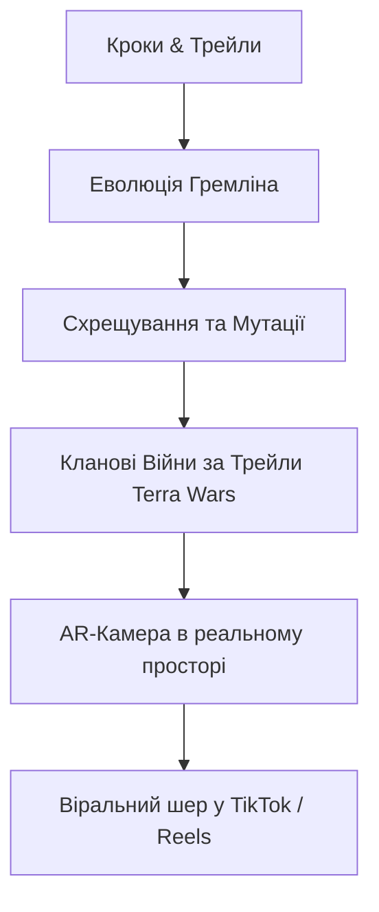

# 🌲 GREMLINS HEALTH 2.0: Master Development & Scaling Plan
## Стратегічний план технічного, продуктового, маркетингового та інвестиційного розвитку

---

## 🧭 1. Архітектурна карта розвитку за 5-ма напрямками (Pillars)

```
┌──────────────────────────────────────────────────────────────────────────────────────────────────┐
│                                 СТРАТЕГІЧНІ ТРЕКИ РОЗВИТКУ                                       │
├───────────────────┬───────────────────┬───────────────────┬──────────────────┬───────────────────┤
│ 1. Engineering    │ 2. GameFi & AI    │ 3. Growth & B2B   │ 4. Token & Legal │ 5. Team & Capital │
│    & Infra        │    Ecosystem      │    Partnerships   │    Compliance    │    Management     │
├───────────────────┼───────────────────┼───────────────────┼──────────────────┼───────────────────┤
│ • Solana Mainnet  │ • 3D AR Cam Engine│ • Salomon/Garmin  │ • Cayman/BVI DAO │ • Pre-Seed / Seed │
│ • React Native    │ • FLUX LoRA v2    │   B2B Quests      │   Foundation     │   ($500k-$1.5M)   │
│   HealthKit/Watch │ • Clan Terra Wars │ • Strava & Clubs  │ • TGE & Liquidity│ • Core Team (8-10 │
│ • TimescaleDB H3  │ • Breeding/Fusion │ • National Parks  │ • Terms & GDPR   │   specialists)    │
└───────────────────┴───────────────────┴───────────────────┴──────────────────┴───────────────────┘
```

---

## 🛠️ ТРЕК 1. Інженерний та Інфраструктурний розвиток (Engineering)

### 1.1. Solana On-Chain Інфраструктура (Mainnet Production)
* **Налаштування Merkle Tree Metaplex Bubblegum:**
  * Створення дерева на $2^{14} = 16,384$ або $2^{20} = 1,048,576$ cNFT.
  * Оренда облікового запису (Rent-Exemption): ~2.5 SOL для дерева на 1 млн NFT.
* **Безгазові транзакції (Gasless Fee Payer / Octane):**
  * Інтеграція бекенд-релеєра: користувач підписує повідомлення в Telegram, а сервер оплачує мікрогаз (\$0.00025).
* **Індексація даних через Helius DAS API:**
  * Швидке зчитування активів користувача без перевантаження блокчейну.

### 1.2. Мобільний трекер (React Native + Нативні мости)
* **Фоновий збір телеметрії (Background Geolocation):**
  * Оптимізація роботи GPS у заблокованому стані телефону без висадки акумулятора.
* **Apple HealthKit & Android Health Connect:**
  * Безшовна двостороння синхронізація кроків, спалених калорій, пульсових зон та барометричного тиску.
* **Garmin Connect Cloud Webhooks:**
  * Автоматичний імпорт GPX/FIT файлів активності з годинників Garmin Fenix/Forerunner без необхідності відкривати додаток під час бігу.

### 1.3. Серверний кластер та Геопросторова БД
* **TimescaleDB + Uber H3 Spatial Indexing:**
  * Швидка перевірка перетину координат трейлу з гексами відкриття карти (Resolution 9).
* **Distributed Task Queue:**
  * Redis Cluster + Celery для паралельної обробки черг мінтингу та античит-валідації при навантаженні >50,000 DAU.

---

## 🎮 ТРЕК 2. Продуктовий геймдизайн, AI та AR (Product & GameFi)



### 2.1. Генетика та Схрещування (Breeding & Fusion)
* **Генетичне дерево:** Можливість схрещувати двох прокачаних Гремлінів різних біомів (наприклад, *Mountain Frost* + *Cyber Shadow* $\rightarrow$ народження міфічного *Aurora Storm Gremlin*).
* **Спалювання батьківських NFT (Deflationary Sink):** Схрещування спалює ресурси та токени, контролюючи загальну пропозицію анімованих персонажів.

### 2.2. Битви за Території (Terra Shrines Dominance)
* На ключових вершинах та в парках розміщуються цифрові «Вівтарі Гільдій» (Shrines).
* Клани змагаються за те, хто сумарно набігає більше кроків на цьому маршруті за тиждень.
* Клан-переможець отримує 50% від усіх торгових комісій NFT, створених у цьому регіоні.

### 2.3. Доповнена Реальність (AR Camera Companion)
* Інтеграція WebXR / Unity AR Foundation: користувач бачить свого Гремліна в реальному масштабі на вершині гори поруч із собою.
* Миттєвий експорт брендованого відео в Instagram Stories та TikTok.

---

## 📈 ТРЕК 3. Маркетинг, B2B та Стратегія Росту (Growth)

### 3.1. B2B Спонсорські Гео-Квести (Brand Engine)
* **Пакет для брендів (Brand Portal):**
  * Особистий кабінет для спортивних компаній (*Salomon, Gorgany, The North Face, Red Bull*).
  * Бренд встановлює: бюджет, маршрут, вимоги до дистанції та завантажує 3D-скини екіпірування.
  * Платформа отримує 15–20% комісії від рекламного бюджету кампанії.

### 3.2. Туристичні Асоціації та Національні Парки
* Партнерство з карпатськими та європейськими заповідниками для просування екологічного туризму (*«Clean Trails / Plogging»*).
* Інтеграція з відомими біговими марафонами (*Kyiv Marathon, Chornohora Skyrace*).

### 3.3. Віральний маркетинг у Telegram (Squads)
* Створення "Бігових Загонів" (Squads) у Telegram з автоматичними лідербордами в чатах.
* Реферальна програма: запроси друга $\rightarrow$ отримуй 5% від його ігрової стаміни протягом 30 днів.

---

## ⚖️ ТРЕК 4. Юридична структура, Токеноміка та TGE (Legal & Token)

### 4.1. Дворівнева Корпоративна Структура
* **DevCo (Операційна компанія):** Реєстрація в юрисдикції ЄС (Польща / Естонія) або Україні (Дія.City) для найму розробників та роботи з брендами.
* **Token Foundation / DAO:** Реєстрація некомерційного фонду на Кайманах чи BVI для емісії токена $GRLN та децентралізованого управління.

### 4.2. Відповідність правилам Apple App Store та Google Play
* Мобільний клієнт позиціонується як Web2 фітнес-геймінг.
* Всі NFT-торги, виведення крипти та стейкінг здійснюються через незалежний Telegram Mini App / Web Hub, що повністю захищає додаток від бану в App Store.

### 4.3. Графік TGE (Token Generation Event)
* **Епоха 1 (Місяці 1–3):** Тільки внутрішньоігрові бали, тестнет, відточування балансу.
* **Епоха 2 (Місяць 4):** Аірдроп токена $GRLN раннім активним хайкерам.
* **Епоха 3 (Місяць 5):** Лістинг на провідних Solana DEX (Raydium, Meteora) та запуск пулів ліквідності з блокуванням LP-токенів.

---

## 👥 ТРЕК 5. Команда, Фінансові Етапи та Бюджет

### 5.1. Необхідний склад команди (Core Team)

| Позиція | Спеціалізація | Завдання |
| :--- | :--- | :--- |
| **Tech Lead / Backend** | Python, FastAPI, TimescaleDB | Архітектура, античит, API, безпека |
| **Mobile Lead** | React Native, Swift, Kotlin | Фоновий трекінг, сенсори, HealthKit |
| **Frontend / Web3 Lead** | React, TypeScript, Solana SDK | Telegram Mini App, гаманці, UI |
| **Smart Contract Dev** | Rust, Solana Anchor, Bubblegum | Он-чейн логіка, cNFT, пули нагород |
| **3D / AI Art Director** | Blender, Stable Diffusion, LoRA | Стиль Гремлінів, анімації, скіни |
| **Head of Growth / BD** | B2B партнерства, ком'юніті | Salomon/Garmin квести, бігові клуби |

### 5.2. Поетапний бюджет запуску (Funding Rounds)

```
┌─────────────────────────────────────────────────────────────────────────────┐
│                            ФІНАНСОВИЙ ГРАФІК                                │
├─────────────────────────────────────────────────────────────────────────────┤
│ 🔹 ЕТАП 1: Pre-Seed / Grants ($80,000 – $150,000) • Місяці 1–3             │
│ • Закінчення закритої бети на 5,000 користувачів.                           │
│ • Отримання гранту від Solana Foundation.                                   │
│ • Запуск маркетингової кампанії в Telegram.                                 │
├─────────────────────────────────────────────────────────────────────────────┤
│ 🔹 ЕТАП 2: Seed Round ($500,000 – $1,200,000) • Місяці 4–6                 │
│ • Масштабування до 50,000+ щоденних користувачів.                           │
│ • Проведення TGE токена $GRLN та створення пулів ліквідності ($200k+).      │
│ • Підписання перших 5-ти міжнародних бренд-контрактів.                      │
├─────────────────────────────────────────────────────────────────────────────┤
│ 🔹 ЕТАП 3: Series A ($3,000,000+) • Місяці 7–12                             │
│ • Глобальна експансія: США, Альпи (ЄС), Японія.                             │
│ • Повноцінний запуск AR-режиму та кланових турнірів Terra Wars.             │
└─────────────────────────────────────────────────────────────────────────────┘
```

---

## 🎯 Чек-лист дій на найближчі 30 днів (Action Items)

- [ ] **Тиждень 1:** Запуск Telegram-бота з WebApp для локального тестування команди.
- [ ] **Тиждень 2:** Деплой бекенду на Hetzner Cloud та Anchor смарт-контрактів у Solana Devnet.
- [ ] **Тиждень 3:** Збір датасету з 30 артів та навчання кастомної LoRA моделі Гремлінів на RunPod.
- [ ] **Тиждень 4:** Онбординг перших 100 хайкерів із Карпатського туристичного клубу для закритого тесту.

---
*Документ збережено як майстер-план розвитку проекту Gremlins Health.*
