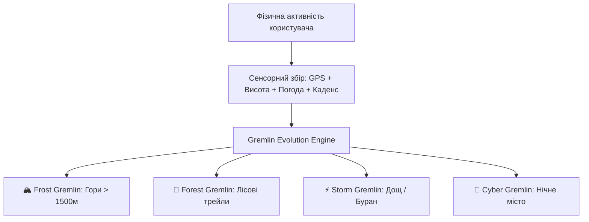
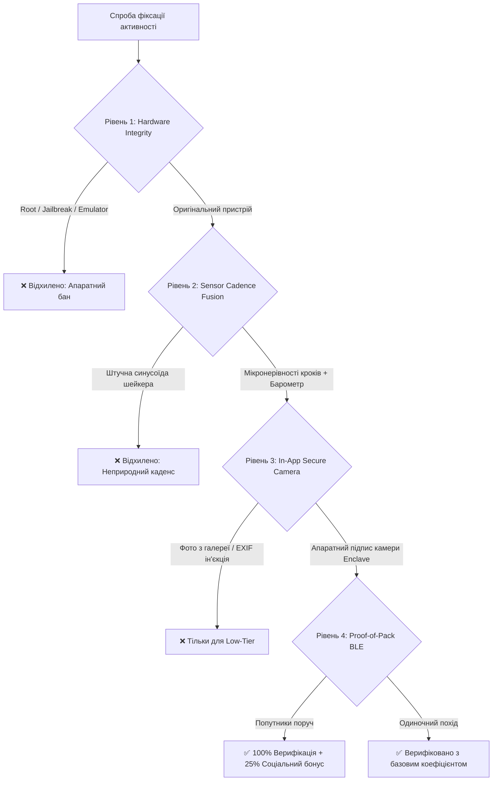

# 🌲 GREMLINS HEALTH 2.0
## Master Product Whitepaper & Technical Architecture Blueprint
**Move-to-Earn • Proof-of-Adventure • Dynamic Living Avatars • Solana cNFT**

---

## 📌 1. Executive Summary & Продуктова Візія

**GREMLINS HEALTH** — це Web3-екосистема нового покоління, яка перетворює реальні фізичні зусилля, туризм та дослідження гірських маршрутів на захопливий гейміфікований досвід із живою цифровою власністю. 

На відміну від класичних Move-to-Earn проектів 1.0 (які страждали від гіперінфляції та відсутності утилітарності), **Gremlins Health 2.0** будується на триєдності:
1. **Dynamic Living Companion (Гремлін):** Персональний цифровий аватар (Dynamic cNFT), чий стан, еволюція та риси безпосередньо залежать від біомів, висоти, погоди та кроків користувача.
2. **Proof-of-Adventure & B2B Sponsorship:** Реальна цінність NFT через колекційні набори маршрутів (Trail Passports) та спонсорські гео-челенджі від глобальних спортивних і туристичних брендів (Salomon, Garmin, The North Face).
3. **Invisible Web3 & Ultra-Low Friction:** Миттєвий вхід через Telegram Mini App з автоматичним визначенням мови (English за замовчуванням, рідна Українська, польська, німецька, іспанська — російська суворо заблокована) без складних налаштувань гаманців, з транзакціями на базі **Solana Compressed NFTs (cNFT)** вартістю менше $0.0001.

```
┌─────────────────────────────────────────────────────────────────────────────┐
│                            ФОРМУЛА GREMLINS HEALTH                          │
│                                                                             │
│   [Реальні Кроки] + [GPS-Біоми] + [Захищена Камера] + [AI-Генерація]        │
│                                     ▼                                       │
│             Живий Гремлін-Компаньйон (Dynamic Solana cNFT)                  │
│                                     ▼                                       │
│   [Кланові Рейди] + [B2B Бренд-Квести] + [Колекційні Альбоми Маршрутів]    │
└─────────────────────────────────────────────────────────────────────────────┘
```

---

## 🌐 2. Багатомовна Архітектура (i18n Localization)

Екосистема розгортається з глобальною багатомовною підтримкою:
* 🇬🇧 **English (`en`)** — Головна глобальна мова платформи за замовчуванням.
* 🇺🇦 **Українська (`uk`)** — Рідна мова карпатських трейлів та базової спільноти.
* 🇵🇱 **Polski (`pl`)** — Для туристів Татр та центральноєвропейських маршрутів.
* 🇩🇪 **Deutsch (`de`)** — Для альпійських бігових спільнот.
* 🇪🇸 **Español (`es`)** — Для міжнародного іспаномовного ком'юніті.
* ❌ **Російська мова (`ru`)** — **Суворо виключена з архітектури та коду проекту**.

---

## 👾 3. Геймдизайн: Живі Гремліни, Біоми та Еволюція

### 3.1. Концепція Гремліна-Компаньйона (Tamagotchi Move-to-Earn)
Кожен гравець на старті безкоштовно отримує базове «Egg Gremlin» (Soulbound cNFT). Гремлін — це живий тамагочі, який супроводжує власника в подорожах.

* **Витривалість та Настрій (Stamina / Mood):**
  * Якщо користувач проходить щоденну норму (наприклад, 8,000–10,000 кроків) — Гремлін бадьорий, отримує досвід (XP) і генерує ігрову енергію.
  * Якщо користувач не активний >48 годин — Гремлін «засинає», а його бонуси деактивуються.
* **Біомна Мутація (Biome-Driven Evolution):**
  Гремлін мутує відповідно до географії та умов, у яких рухається людина:
  * **Mountain Frost Gremlin (Гірський біом):** Висота >1,500м, низька температура. Відкриває риси крижаної броні та стійкості.
  * **Forest Guardian Gremlin (Лісовий біом):** Трейли в заповідниках і лісах. Набуває дерев'яних рогів та трав'яних елементів.
  * **Cyber-Shadow Gremlin (Міський урбан):** Нічні прогулянки мегаполісами. Неонові акценти, цифрові окуляри.
  * **Stormbringer Gremlin (Екстремальні умови):** Активність під час грози, зливи або бурану. Рідкісні блискавичні аури.



### 3.2. Карта Дослідження «Туман Війни» (Fog of War)
* Весь світ у додатку вкритий шаром туману за стандартом гексагональної сітки **Uber H3 (Resolution 9–10)**.
* Кожен реальний кілометр відкриває гекси на персональній та глобальній мапі.
* **Досягнення регіонів:** Відкриття 100% району міста або національного парку дарує унікальний статусний артефакт.

### 3.3. Кооперативні Рейди (Clan Raid Bosses)
* Щомісячні глобальні боси (наприклад, *«Титанічний Голем Трейлів»* з 10,000,000 HP).
* Спільноти та бігові клуби об'єднуються у клани: 50 людей протягом 48 годин повинні сумарно виходити 1,000,000 кроків, щоб завдати шкоди босу та отримати пул нагород у токенах і спонсорських ваучерах.

---

## 💎 4. Економічна Модель та Токеноміка 2.0 (Sustainable Flywheel)

### 4.1. Двотокенова Архітектура з нульовою інфляцією
Щоб уникнути краху моделі P2E, розмежовано м'яку внутрішню валюту та ліквідний governance-токен.

```
┌─────────────────────────────────────────────────────────────────────────────┐
│                         ТОКЕНОМІЧНИЙ ДВОКОНТУРНИЙ ЦИКЛ                      │
├──────────────────────────────────────┬──────────────────────────────────────┤
│ 🔋 STAMINA / ENERGY (Off-Chain Soft) │ 🪙 $GRLN (Solana On-Chain Utility)  │
├──────────────────────────────────────┼──────────────────────────────────────┤
│ • Генерується щоденними кроками.     │ • Фіксована емісія (Hard Cap).       │
│ • Не має прямого виведення в кеш     │ • Торгується на DEX (Raydium, Orca). │
│   (захист від ботоферм).             │ • Використовується для стейкінгу,    │
│ • Витрачається на годування Гремліна,│   викупу спонсорських слотів, DAO-   │
│   крафт базового екіпірування та     │   голосування та схрещування рід-    │
│   активацію квестів.                 │   кісних Гремлінів.                  │
└──────────────────────────────────────┴──────────────────────────────────────┘
```

### 4.2. Чому NFT купуватимуть: 3 фундаментальні драйвери ринку
1. **Колекційні Альбоми Маршрутів (Trail Master Passports):**
   * Збір повного сета (наприклад, усі 6 двохтисячників Карпат) відкриває доступ до щоквартального призового фонду туризму.
   * Колекціонери та ентузіасти купують відсутні вершини у реальних хайкерів.
2. **B2B Brand Bounty Pools:**
   * Спортивні бренди створюють оплачені маркетингові квести. Бренд вносить 5,000 USDC у призовий фонд, який розподіляється між власниками верифікованих NFT з їхнього маршруту.
3. **GameFi Battle/Raid Multipliers:**
   * Рідкісні NFT-локації слугують «підсилювачами стихій» у кланових битвах.

### 4.3. Спалювання Токенів (Deflationary Sinks)
* **Re-roll AI Art:** 5 $GRLN за зміну стилю арту.
* **Gremlin Fusion:** 30% вартості злиття двох NFT спалюється назавжди.
* **Marketplace Fee:** 5% комісія (2% команді, 2% у призові пули, 1% спалювання $GRLN).

---

## 🛡️ 5. Куленепробивна система Anti-Cheat та Безпеки

Традиційні Move-to-Earn проекти вмирають через емулятори кроків (*Defit*, шейкери) та підміну GPS (*Fake GPS*). Gremlins Health 2.0 впроваджує 4-рівневу систему верифікації.



### 5.1. Складові захисту
1. **Apple DeviceCheck & Google Play Integrity:** Підтверджує, що додаток запущено на реальному немодифікованому залізі.
2. **Micro-Cadence & Barometer Variance:** Реальна ходьба супроводжується хаотичними мікроінтервалами між кроками та корелює з перепадами тиску (висоти).
3. **In-App Hardware Camera Signature:** Для мінту рідкісних рівнів знімок робиться виключно всередині додатку та підписується криптографічним анклавом смартфона.
4. **Proof-of-Pack (BLE Mesh):** Bluetooth-рукостискання між смартфонами попутників підтверджує присутність групи в одній гео-точці.

---

## 🔒 6. Приватність, Екологія та Інклюзивність

### 6.1. Захист від переслідування (Privacy by Design)
* **Privacy Safe Zones:** Радіус 1 км навколо дому чи роботи автоматично стирається з публічних GPS-треків.
* **Anti-Stalking Delay:** Публікація трейлу на маркетплейсі дозволена лише через 3 години після виходу із зони трейлу.

### 6.2. Екологія та Захист заповідників (Anti-Overtourism)
* **Geo-Fencing заборонених зон:** Військові об'єкти, небезпечні скелі та закриті природні заповідники виключені з карти активностей.
* **Plogging Eco-Quests:** Фотопідтвердження зібраного сміття на трейлі дає додаткові бали карми та рідкісні еко-скіни для Гремліна.

### 6.3. Інклюзивність та Захист серій
* **Campfire Freeze:** Заморозка щоденної серії на 3–7 днів у разі хвороби чи травми без втрати рейтингу.
* **Indoor / Wheelchair Modes:** Підтримка занять на бігових доріжках та інтеграція спеціальних режимів активності для людей на візках через Apple HealthKit.

---

## 🏗️ 7. Технічна Архітектура та Технологічний Стек 2.0

```mermaid
graph LR
    subgraph Client Surfaces
        TMA[Telegram Mini App - React/Vite/i18n] -->|Соціалка, Маркетплейс, Профіль, P2P| API[FastAPI Gateway]
        NATIVE[iOS & Android Native Tracker] -->|HealthKit/Connect, Secure Camera, BLE| API
        WATCH[Garmin / Apple Watch] -->|FIT/GPX Telemetry| API
    end

    subgraph Core Backend & Security
        API --> RL[Sliding Window Rate Limiter]
        RL --> DB[(TimescaleDB / PostgreSQL)]
        RL --> REDIS[Redis Queues]
        REDIS --> WORKER[Celery Worker Cluster]
        WORKER --> AI[FLUX Schnell / SDXL LoRA Engine]
        WORKER --> AC[Anti-Cheat Telemetry Engine]
    end

    subgraph Web3 Layer (Solana)
        AC --> SOL[Anchor Smart Contracts]
        SOL --> CNFT[Metaplex Bubblegum cNFT]
        CNFT --> ARW[Irys / Arweave Storage]
    end
```

### 7.1. Стек компонентів
* **Telegram Mini App:** React 18, TypeScript, TailwindCSS, Lucide Icons, Telegram WebApp SDK Bridge з тактильним відгуком (Haptics), багатомовність (i18n).
* **Бекенд:** Python 3.11 (FastAPI), TimescaleDB (для GPS-серій), Redis, Celery, RateLimiter.
* **Telegram Бот:** aiogram 3.x з HMAC-SHA256 валідацією WebApp initData.
* **AI-Рендеринг:** Власний сервіс на базі `FLUX.1-schnell` + `ControlNet` + кастомний LoRA стиль Гремлінів на GPU spot-серверах (вартість <$0.003 за арт).
* **Блокчейн:** Solana Mainnet, Anchor Framework, Metaplex Bubblegum (cNFT), Irys (Arweave) для безстрокового збереження метаданих.
* **Хостинг:** Hetzner Cloud (Німеччина) з автоматизованим розгортанням через Docker & Nginx.

---

## 🚀 8. Дорожня Карта Реалізації (Roadmap)

```
┌─────────────────────────────────────────────────────────────────────────────┐
│                               ФАЗИ РОЗРОБКИ                                 │
├─────────────────────────────────────────────────────────────────────────────┤
│ 🟢 ФАЗА 1: Telegram Mini App & Off-Chain Season (Місяці 1–2)                │
│ • Запуск TMA гри з віртуальним Гремліном-Тамагочі.                          │
│ • Базовий облік кроків, реферальна система та таблиці лідерів.              │
│ • Накопичення ігрових балів перед TGE.                                      │
├─────────────────────────────────────────────────────────────────────────────┤
│ 🔵 ФАЗА 2: Нативний додаток, cNFT та Захищена камера (Місяці 3–4)           │
│ • Реліз iOS та Android трекера з підтримкою фонового збору даних.           │
│ • Інтеграція Solana Bubblegum cNFT та AI-пайплайну арту.                    │
│ • Запуск внутрішнього маркетплейсу та системи Trail Passports.              │
├─────────────────────────────────────────────────────────────────────────────┤
│ 🟣 ФАЗА 3: B2B Бренд-Квести, Garmin & Phygital NFC (Місяці 5–6)             │
│ • Підключення спортивних партнерів (Salomon, Gorgany, The North Face).      │
│ • Інтеграція Garmin Connect та Apple Watch.                                 │
│ • Випуск лімітованого мерчу з зашифрованими NFC-чіпами.                     │
│ • Лістинг $GRLN токена на децентралізованих біржах (Raydium).              │
└─────────────────────────────────────────────────────────────────────────────┘
```

---
*Документ створено для команди та ком'юніті Gremlins Health.*
*Версія: 2.0 Master Blueprint • 2026*
